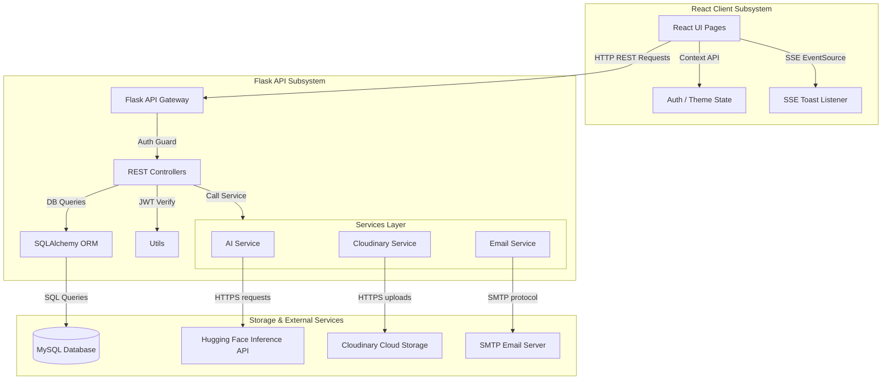
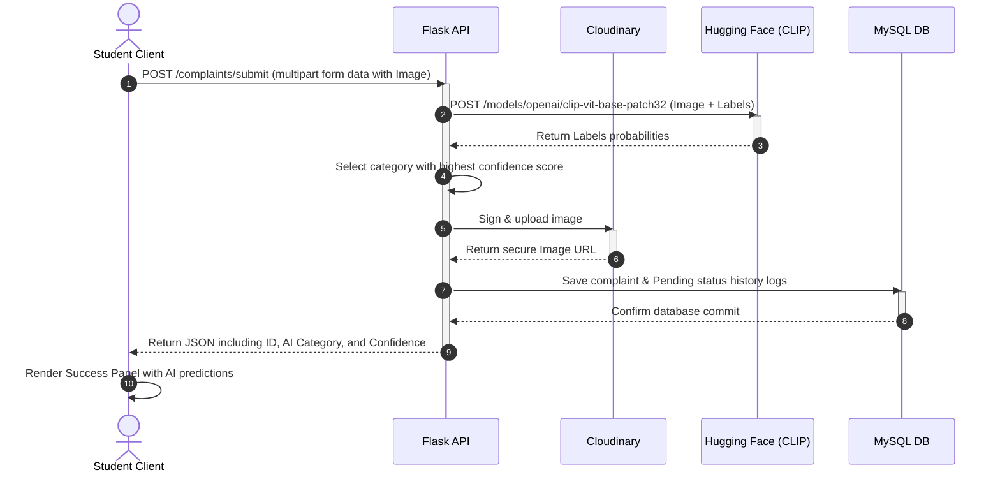
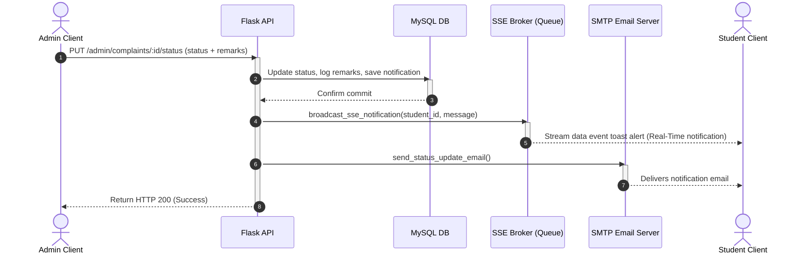

# System Architecture Documentation

This document explains the technical architecture, data flow, and system integration patterns for the **AI Smart Campus Assistant**.

---

## 1. High-Level Architecture Diagram

The system follows a classic **Client-Server-Database** architecture with external integrations for Artificial Intelligence (Hugging Face) and file storage (Cloudinary).

---

## 2. Key Transaction Sequences

### 2.1. Issue Submission & AI Classification Flow
This sequence details what happens when a student submits an issue with an image attachment:

---

## 2.2. Status Modification & Real-Time Alert Broadcast
This sequence details the dispatching of automated email alerts and real-time notifications to the client browser when an admin modifies a complaint's status:

---

## 3. Key Design Decisions & Architectural Quality

1.  **Thread-Safe SSE Broker**: By using Python's built-in `queue.Queue` list, the application manages multi-client Server-Sent Events streams natively inside the Flask thread pool. This allows real-time notifications to push without using heavy Node.js Socket.io or Redis systems, keeping local deployment simple and lightweight.
2.  **Graceful API Fallbacks (Self-Healing AI)**: The AI service checks if a Hugging Face API key is present in `.env`. If offline or without key, it extracts keywords from filenames (for images) and query strings (for chat) to simulate classification and lookup. The UI remains fully functional and visual in offline presentation environments.
3.  **Client-Side Blob Download**: PDF reports and Excel exports are compiled on the server (using ReportLab and Pandas respectively) and returned as raw binary streams. The React client intercepts these responses as `Blob` types, creating a local browser URL dynamically to trigger standard downloads. This prevents writing temporary files to the server disk, saving storage space.
